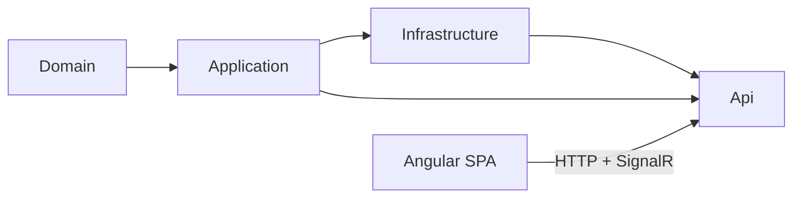
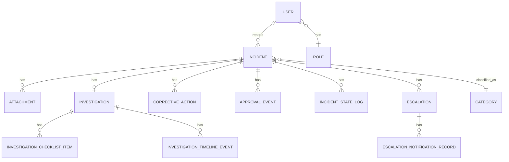

# Architecture Spine — FactoryShield

## Design Paradigm

**Clean Architecture (layered).** One-directional dependency flow: `Domain ← Application ← Infrastructure ← Api`. Domain is pure (entities, enums, no external references). Application holds business logic as MediatR Commands/Queries against interfaces it defines. Infrastructure implements those interfaces (EF Core, SignalR, Hangfire, file storage). Api composes everything into HTTP controllers. The Angular frontend is a separate SPA consuming the API over HTTP + one SignalR hub; it carries its own internal paradigm (standalone components + signals) but is otherwise a client, not a layer in the backend's dependency graph.



## Invariants & Rules

### AD-1 — One-directional dependency flow between backend layers

- **Binds:** all four backend projects (Domain, Application, Infrastructure, Api)
- **Prevents:** a new feature adding an EF Core/HTTP reference into Domain, or Application calling an Infrastructure concrete class instead of the interface it defines
- **Rule:** Domain has zero external package/project references. Application references only Domain and defines interfaces Infrastructure implements. Infrastructure and Api may reference anything below them; nothing below may reference up. [ADOPTED]

### AD-2 — CQRS via MediatR is the only business-logic entry point

- **Binds:** all Application-layer logic
- **Prevents:** business logic leaking into controllers, or Infrastructure/Api calling repositories directly instead of going through a Command/Query
- **Rule:** every write is a `Command` + `CommandHandler`; every read is a `Query` + `QueryHandler`, under `Application/<Feature>/Commands|Queries/`. Controllers only translate HTTP ↔ `IMediator.Send()`. [ADOPTED]

### AD-3 — Incident status has exactly one writer

- **Binds:** all incident lifecycle code (reporter submit, approver actions, resolver actions, governance gates)
- **Prevents:** two independently-built features each hand-rolling incompatible status transitions that bypass the legal-transition map
- **Rule:** `Incident.Status` is mutated only via the injected `IIncidentStateMachine.TransitionAsync()`, which enforces a legal-transition adjacency map and throws on an illegal hop. No other code path may assign the property. [ADOPTED]

### AD-4 — Validators are explicitly wired, never scanned

- **Binds:** every Command that needs validation
- **Prevents:** a validator existing in code but silently never executing because nothing registered it
- **Rule:** FluentValidation validators are registered one-by-one in `Program.cs` (`AddScoped<IValidator<TCommand>, TValidator>()`); assembly-scanning registration is prohibited. [ADOPTED]

### AD-5 — Every role-gated capability is gated on both sides

- **Binds:** all role-restricted features, frontend and backend
- **Prevents:** a role seeing a nav link or UI affordance that 403s because only one side implemented the gate — this has already recurred three times (Analytics nav, dashboard's pending-approvals call, All-Incidents scoping)
- **Rule:** the backend `[Authorize(Policy = "...")]` is the actual security boundary. Any endpoint carrying one must have a matching frontend route guard and/or conditional UI render using the same role set; the two role sets must be kept in sync by inspection whenever either changes. [ADOPTED]

### AD-6 — Real-time auth travels by query string, not header

- **Binds:** `NotificationHub` and any future SignalR hub
- **Prevents:** a second real-time feature inventing an incompatible auth-transport convention
- **Rule:** SignalR connections authenticate via `?access_token=<jwt>` on the hub URL, because a browser WebSocket handshake cannot set a custom `Authorization` header. [ADOPTED]

### AD-7 — Audit and approval records are immutable at the database

- **Binds:** `approval_events`, `incident_state_log`
- **Prevents:** a future admin/compliance feature adding an edit-history or undo capability on audit data
- **Rule:** both tables have `REVOKE UPDATE, DELETE` for the application's database role. No soft-delete flag, no admin override, anywhere in the application layer. [ADOPTED]

### AD-8 — Severity is an integer; labels are a projection

- **Binds:** `Incident.Severity` and every place severity is displayed
- **Prevents:** a second feature (e.g. reporting/analytics) introducing a parallel string-based severity representation that drifts from the canonical value
- **Rule:** severity is stored as `SMALLINT 1-4`. Critical/High/Medium/Low labels are computed at the presentation edge, never persisted. [ADOPTED]

### AD-9 — Frontend is standalone-components-and-signals only

- **Binds:** every Angular component
- **Prevents:** a new component reintroducing NgModule or `*ngIf`/`*ngFor` patterns that fragment the codebase's mental model
- **Rule:** components are `standalone: true`, state is signal-based (`signal`/`computed`/`effect`), templates use `@if`/`@for` control flow exclusively. [ADOPTED]

### AD-10 — Charting is apexcharts-core-only

- **Binds:** any feature rendering a chart
- **Prevents:** a build break from a future contributor reaching for the more obvious `ng-apexcharts` wrapper
- **Rule:** charts use the `apexcharts` core library through the existing `ChartComponent` wrapper (`afterNextRender` + `effect`). `ng-apexcharts` must never be installed or imported — its peer-dependency requires Angular ≥20, and this project is pinned to 19.2. [ADOPTED]

### AD-11 — Time-triggered work runs through Hangfire, never an ad-hoc timer

- **Binds:** any new time/schedule-triggered backend feature
- **Prevents:** a feature adding its own in-process polling loop that silently loses state across a process restart
- **Rule:** recurring backend work (SLA checks, escalation, stale-draft monitoring, notification reminders) is a Hangfire recurring job backed by the PostgreSQL job store. [ADOPTED]

## Consistency Conventions

| Concern | Convention |
| --- | --- |
| Naming (entities, files, interfaces, events) | Backend: `<Verb><Noun>Command`/`Query` + matching `...Handler`; interfaces prefixed `I`. Frontend: `app-<feature>` selectors, one component per route, kebab-case files. |
| Data & formats (ids, dates, error shapes) | `IncidentReference` follows `INC-{YYYY}-{NNNN}`, generated in the command handler (not a DB sequence, so it's portable across Postgres/SQLite in tests). Error responses are `{ "error": "<message>" }` JSON with the matching HTTP status. |
| State & cross-cutting (mutation, auth, query composition) | State mutation only via `IIncidentStateMachine` (AD-3). Auth double-gated (AD-5). EF Core/Npgsql cannot translate `Count(predicate)` inside a grouped `Select()` — project needed columns via `ToListAsync()` first, then group/count client-side. |

## Stack

| Name | Version |
| --- | --- |
| Angular | 19.2.0 (standalone components, no NgModules) |
| TypeScript | 5.7.2 (`strict`, `strictTemplates`, `strictInjectionParameters`) |
| RxJS | ~7.8 |
| apexcharts (core) | 5.15.2 |
| .NET | 10 (`net10.0`) |
| Entity Framework Core | 9.x |
| Npgsql.EntityFrameworkCore.PostgreSQL | 9.x |
| Hangfire.AspNetCore / .Core | 1.8.20 |
| Hangfire.PostgreSql | 1.20.11 |
| Microsoft.AspNetCore.Authentication.JwtBearer | 10.0.9 |
| Swashbuckle.AspNetCore | 10.2.3 |
| PostgreSQL | single on-premise instance |
| Playwright (`@playwright/test`) | E2E only — no unit test projects exist |

## Structural Seed

```text
src/
  FactoryShield.Domain/          # entities, enums — zero external deps
  FactoryShield.Application/     # <Feature>/Commands|Queries + Handlers, interfaces, FluentValidation validators
  FactoryShield.Infrastructure/  # Persistence (EF Core, migrations), Realtime (SignalR), Jobs (Hangfire), Services
  FactoryShield.Api/             # Controllers, Program.cs (DI, auth policies, CORS)
frontend/src/app/
  core/                          # AuthService, guards, cross-cutting services (RecentIncidentService, etc.)
  shared/                        # ChartComponent and other reusable standalone components
  features/                      # one folder per role/workflow area (incidents, resolver, governance, analytics, ...)
```

**Deployment & environments:** single-factory, on-premise. One PostgreSQL instance backs both the application data and the Hangfire job store. The .NET Api and the Angular SPA are built/deployed as separate artifacts (API serves JSON + one SignalR hub at `/hubs/notifications`; Angular is a static build served independently); no containerization or multi-environment topology has been established yet — Deferred.



## Capability → Architecture Map

| Capability / Area | Lives in | Governed by |
| --- | --- | --- |
| FR-1..FR-8 (Reporting) | `IncidentController` (create/mine/attachments/offline-sync), `frontend/features/report` | AD-1, AD-2, AD-4 |
| FR-9..FR-19 (Review & Triage) | `ApproverController`, `Application/Approver/*`, `frontend/features/approver` | AD-2, AD-3, AD-5 |
| FR-20..FR-27 (Investigation & Resolution) | `InvestigationController`, `RcaController`, `Application/Investigation/*`, `frontend/features/resolver` | AD-2, AD-3 |
| FR-28..FR-33 (Governance) | `GovernanceController`, `Application/Governance/*`, `frontend/features/governance` | AD-3, AD-5, AD-7 |
| FR-34..FR-40 (Compliance & Analytics) | `ComplianceController`, `AnalyticsController`, `Application/Compliance|Analytics/*`, `frontend/features/analytics` | AD-5, AD-7, AD-8, AD-11 |

## Deferred

- **Department as FK vs string.** A full `departments` table was considered; deferred because the MVP has no department-management UI to seed it from. Revisit when FR-39 (Admin user management) ships.
- **Automated test suite.** No unit/integration test project exists for backend or frontend; verification today is manual + ad hoc Playwright scripts. Revisit before the next major refactor of the incident state machine or approval pipeline, where regressions would be expensive to catch manually.
- **Containerization / multi-environment topology.** Currently single on-premise deployment with no staging/prod split defined at the infrastructure level. Revisit if a second factory site or a cloud migration is planned.
- **Multi-tenant / multi-factory.** Explicitly out of scope for this phase (PRD §9); the single-database, no-tenant-column design would need revisiting first.
- **Real push/email/SMS notification delivery, offline sync, QR entry, AI root-cause suggestion, Bangla-first UI.** All out of scope per PRD §9; no architectural commitment made toward them yet.
